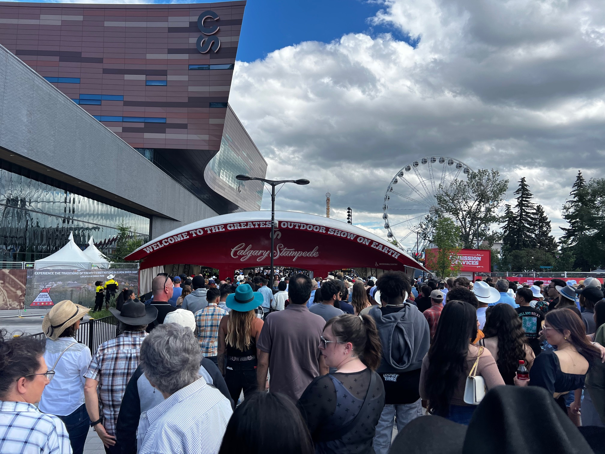
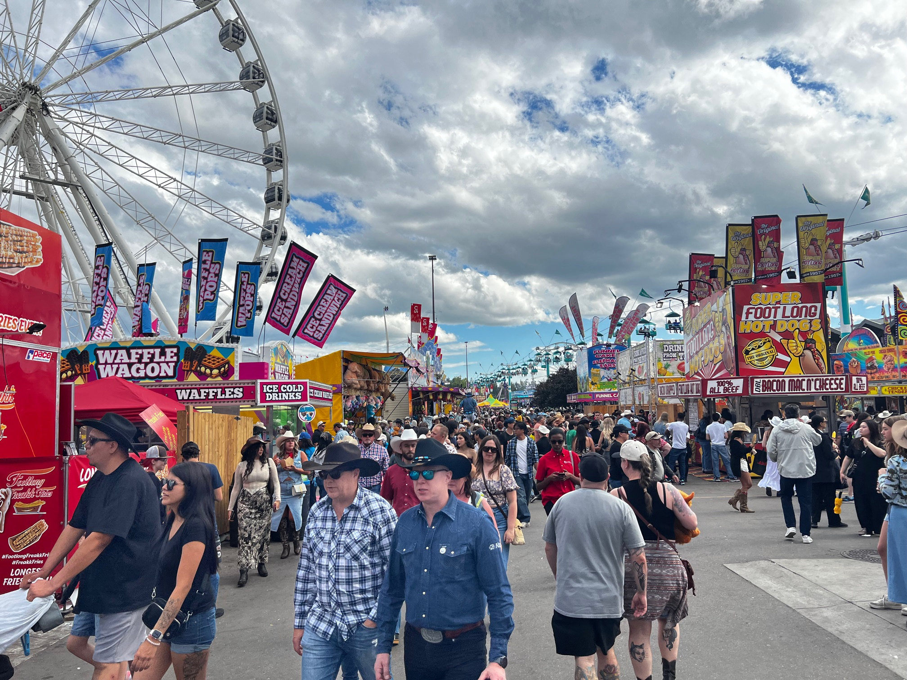
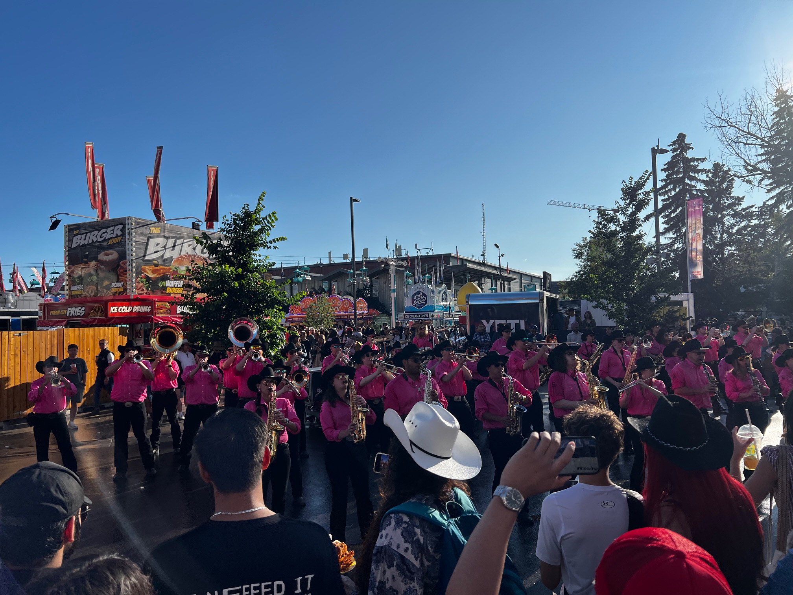
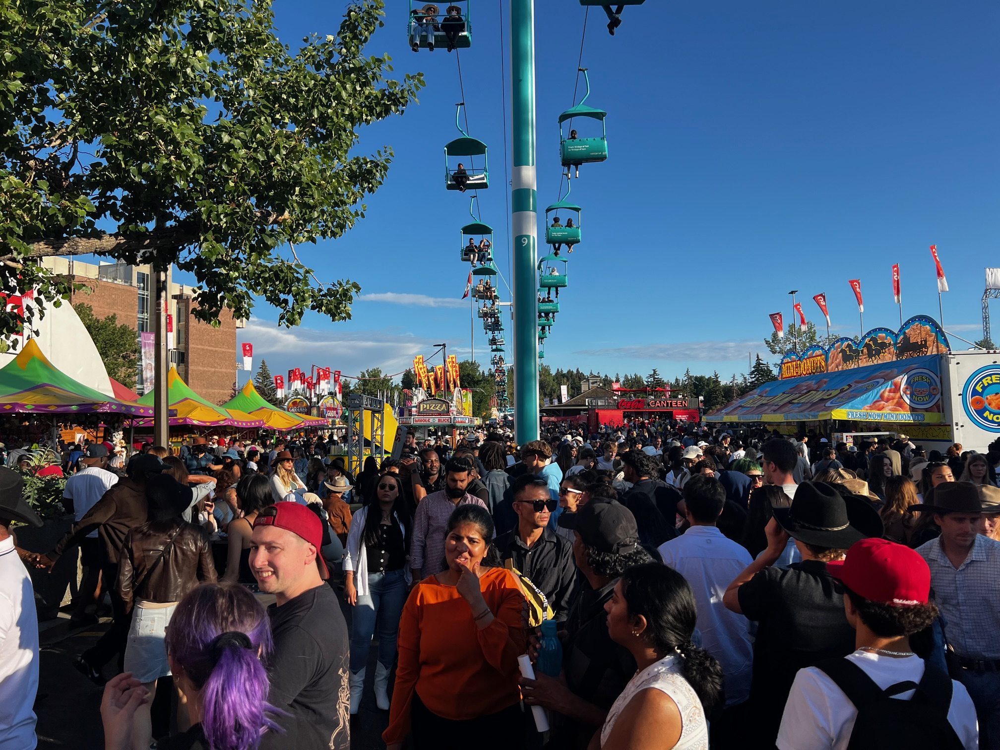
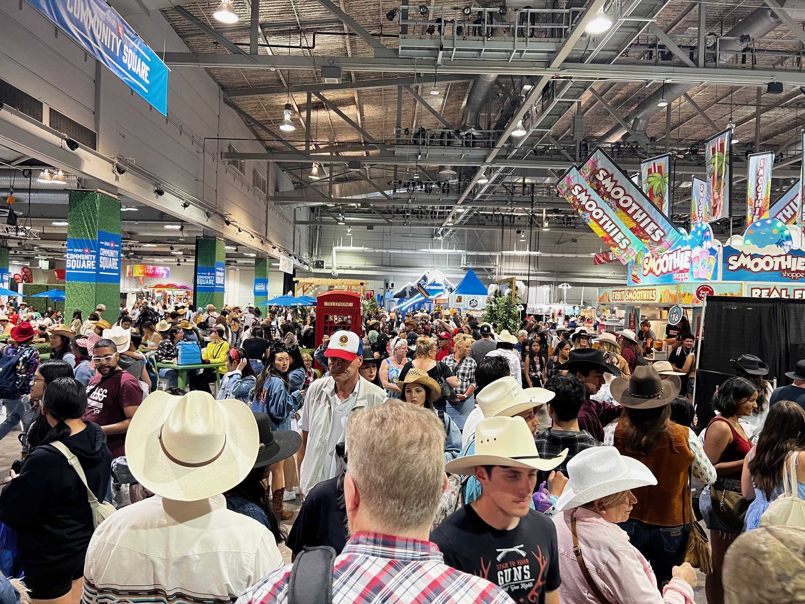
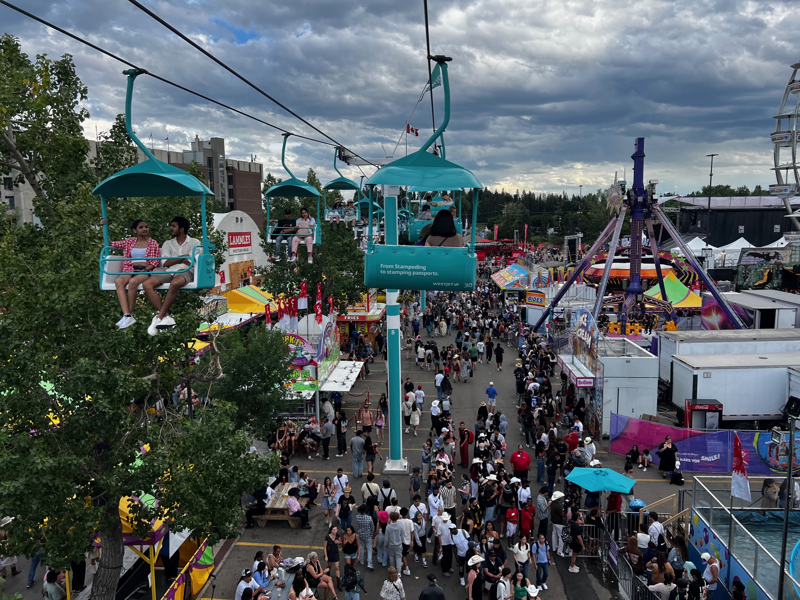

## カルガリー・スタンピードとは？

毎年7月、カナダ・アルバータ州カルガリーは、世界中から100万人以上の観光客を迎える巨大なお祭りに包まれます。それが「**カルガリー・スタンピード（Calgary Stampede）**」です。

「地球上で最も偉大な野外ショー（The Greatest Outdoor Show on Earth）」と呼ばれるこのイベントは、単なるロデオ大会ではありません。カナダ西部の開拓時代の精神を今に伝える、壮大な文化祭典なのです。

## 🤠 スタンピードの歴史と由来

### 始まりは1912年

カルガリー・スタンピードの歴史は、1912年に遡ります。アメリカ人のショーマン、**ガイ・ウィーディック（Guy Weadick）**が、カウボーイたちの技術を競い合うロデオ大会を開催したのが始まりでした。

当時のカルガリーは、牧畜業で栄えた新興都市。カウボーイたちは日常的に馬を乗りこなし、牛を扱う技術を磨いていました。スタンピードは、そんな彼らの誇りと技術を披露する場として誕生したのです。

### 名前の由来

「スタンピード（Stampede）」とは、もともと「家畜の群れが驚いて一斉に走り出すこと」を意味します。開拓時代、牛の群れが雷や野生動物に驚いて暴走することは、カウボーイたちにとって最も危険な出来事でした。この言葉には、西部開拓時代の荒々しさと、それを制御するカウボーイたちの勇敢さが込められています。

## 📊 驚きの規模と数字

現在のカルガリー・スタンピードは、世界最大級のロデオイベントに成長しました。その規模を数字で見てみましょう。

**イベント規模：**
- 開催期間：10日間（毎年7月第1金曜日から）
- 会場面積：約80ヘクタール（東京ドーム17個分）
- 年間来場者数：約120万人
- 経済効果：約5億4000万カナダドル

**賞金総額：**
- ロデオ競技賞金：200万カナダドル以上
- チャックワゴンレース賞金：150万カナダドル
- 世界最高額のロデオ賞金を誇る

## 🎪 会場の魅力

### スタンピード・パーク

メイン会場となる「スタンピード・パーク」は、まさに巨大なテーマパークです。東京ディズニーランドの1.5倍もの広さがある会場内には、様々な施設とアトラクションが所狭しと並んでいます。

**主要施設：**
- グランドスタンド（収容人数：17,000人）
- サドルドーム（収容人数：19,000人）
- ビッグ・フォー・ビルディング（展示場）
- ナッシュビル・ノース（カントリー音楽会場）
- BMOセンター（多目的イベント施設）

## 🏍️ スリル満点のエンターテイメント

### モトクロス・スタントショー

会場では、モンスターエナジー主催の**モトクロス・スタントショー**が大人気です。プロのライダーたちが、信じられないような空中技を次々と披露します。

バイクが空高く舞い上がり、回転したり、ライダーがバイクから離れたりする大技の連続に、観客からは歓声と驚きの声が上がります。しかも、モンスターエナジーの無料ドリンク配布もあり、興奮と喉の渇きを同時に満たしてくれます。

このような現代的なエクストリームスポーツと、伝統的なロデオ文化が共存しているのも、スタンピードの魅力の一つです。

### 音楽で彩られる会場

会場のあちこちでは、大勢のミュージシャンたちが楽器を演奏し、祭りの雰囲気を盛り上げています。

カントリーミュージックはもちろん、ロック、ポップス、フォークなど、様々なジャンルの音楽が会場内に響き渡ります。通りを歩いているだけで、生演奏に出会えるのがスタンピードの魅力。音楽と笑い声、そして歓声が混ざり合い、会場全体が巨大な野外音楽フェスティバルのような賑やかさです。

### 活気あふれる会場の様子

スタンピード会場は、まさに人、人、人！どこを見ても大勢の来場者で溢れています。家族連れ、カップル、友人グループ、そして世界中からの観光客が、思い思いに楽しんでいます。

フードトラックが立ち並ぶエリア、ゲームブースが続く通り、アトラクションの行列、そしてあちこちで開催されているパフォーマンス。この活気と熱気は、実際に体験しないと分からない特別なものです。

## 🏢 BMOセンター内の熱気

**BMOセンター**の中も、外の会場に負けないほどの活気に溢れています。この巨大な屋内施設では、様々な展示やイベントが同時進行しています。

農業機械の展示、家畜の品評会、工芸品の実演販売、そして地元企業のブース。エアコンの効いた快適な環境で、ゆっくりと見て回ることができます。特に暑い日中は、多くの人がここで涼みながら、展示を楽しんでいます。

屋内でも、カウボーイハットをかぶった人々の笑顔と活気は変わりません。

## 🚡 上空から見るスタンピード

### WestJet Skyrideから見る絶景

会場を横断する**WestJet Skyride**は、スタンピードの人気アトラクションの一つです。カナダの航空会社WestJetがスポンサーとなっているこのスカイライドは、会場の端から端まで空中散歩を楽しめます。

地上から見ると迷路のように感じる巨大な会場も、上空からは全体像が把握できます。カラフルなテント、整然と並ぶアトラクション、そして蟻のように動き回る人々。ゆったりと移動しながら眺める景色は、まさに「地球上で最も偉大な野外ショー」の規模を実感させてくれます。

特に夕暮れ時のスカイライドは人気で、夕日に染まるカルガリーの街並みと、ライトアップされ始める会場の両方を楽しむことができます。片道約10分の空の旅は、歩き疲れた足を休めるのにも最適です。

## 🏇 メインイベント：ロデオ競技

### 世界最高峰のカウボーイたち

スタンピードの中心は、やはりロデオ競技です。世界中から集まったトップカウボーイたちが、危険と隣り合わせの競技に挑みます。

**主要競技種目：**

1. **ブル・ライディング**
   - 暴れ牛に8秒間乗り続ける
   - 最も危険で人気の高い競技

2. **ブロンク・ライディング**
   - 暴れ馬に乗る競技
   - サドル付きとベアバック（鞍なし）の2種類

3. **ステア・レスリング**
   - 走る牛を馬上から飛び降りて倒す
   - スピードと技術が求められる

4. **タイダウン・ローピング**
   - 子牛をロープで捕らえて縛る
   - カウボーイの実用技術から発展

5. **バレル・レーシング**
   - 女性騎手による樽を回るタイムレース
   - スピードと正確性が勝負の鍵

## 🐎 チャックワゴン・レース

### 「地獄の半マイル」

スタンピードのもう一つの目玉が、「**レンジランド・ダービー**」と呼ばれるチャックワゴン・レースです。

チャックワゴンとは、開拓時代に料理道具や食料を運んだ幌馬車のこと。4頭の馬が引く馬車が、土煙を上げながら疾走する様子は圧巻です。

**レースの特徴：**
- 4チームが同時に競走
- 1周約1.2キロメートルのトラック
- 最高時速：約60キロメートル
- 「地獄の半マイル」と呼ばれる危険なレース

観客席から聞こえる地鳴りのような馬のひづめの音、舞い上がる砂埃、そして熱狂する観客の歓声。この興奮は、実際に体験しないと分からない迫力があります。

## 🎭 文化イベントと伝統

### 先住民文化の祭典

スタンピードは、カナダの先住民文化を称える重要な場でもあります。

**インディアン・ビレッジ：**
- 5つの先住民族が参加
- ティピー（伝統的テント）の展示
- 伝統舞踊と音楽の披露
- 工芸品の実演販売

### パンケーキ朝食

スタンピード期間中、カルガリー市内のあちこちで無料のパンケーキ朝食が振る舞われます。これは100年以上続く伝統で、地域コミュニティの絆を深める大切なイベントです。

**パンケーキ朝食の規模：**
- 市内200カ所以上で開催
- 期間中に約40万食を提供
- ボランティア数：5,000人以上

## 🎪 昼も夜も続くショー

### グランドスタンド・ショー

毎晩開催される大規模なステージショーは、スタンピードのハイライトの一つ。有名アーティストのコンサート、アクロバット、花火など、2時間以上にわたる壮大なパフォーマンスが繰り広げられます。

### ナッシュビル・ノース

カントリー音楽の聖地として知られる屋外ステージ。カナダや米国のトップアーティストが連日出演し、本場のカントリーミュージックを楽しめます。

## 🍖 食の楽しみ

### カルガリー名物を堪能

スタンピードの楽しみの一つが、多彩な食べ物です。

**必食グルメ：**
- **アルバータ牛のステーキ**：世界的に有名な高品質牛肉
- **ミニドーナツ**：揚げたて熱々の定番スイーツ
- **コーンドッグ**：北米の定番フェスティバルフード
- **プーティン**：カナダ名物のフライドポテト料理

最近では、「ディープフライド・オレオ」や「ベーコン巻きあらゆるもの」など、ユニークな創作料理も話題を呼んでいます。

## 👗 カウボーイファッション

### 街全体がウェスタンスタイル

スタンピード期間中、カルガリーの街は一変します。普段はスーツ姿のビジネスマンも、この時期だけはカウボーイハットとブーツに身を包みます。

**定番アイテム：**
- カウボーイハット（白が伝統的）
- ウェスタンブーツ
- チェック柄のシャツ
- デニムジーンズ
- ボロタイ

地元の人々は「スタンピード・ファッション」を楽しみ、観光客も一緒になって西部開拓時代の雰囲気を味わいます。

## 🎓 留学生にとっての意義

### カナダ文化を体験する絶好の機会

カルガリー・スタンピードは、留学生にとってカナダの歴史と文化を肌で感じる貴重な機会です。

**学べること：**
- カナダ西部の開拓史
- 先住民文化への理解
- 地域コミュニティの結束力
- カナダ人のホスピタリティ

多くの語学学校や大学では、スタンピード期間中に特別な見学ツアーを企画しています。クラスメートと一緒に参加することで、忘れられない思い出を作ることができるでしょう。

## 📝 訪問のコツ

### より楽しむために

**おすすめの過ごし方：**

1. **早めのチケット購入**
   - 人気イベントは早期売り切れ
   - オンライン事前購入で割引も

2. **平日の訪問**
   - 週末より混雑が少ない
   - ゆっくり楽しめる

3. **快適な服装**
   - 歩きやすい靴は必須
   - 日焼け止めと帽子
   - 夜は冷えるので上着を

4. **計画的な行動**
   - 会場マップを事前確認
   - 人気イベントの時間をチェック
   - 休憩時間も計画に入れる

## まとめ

カルガリー・スタンピードは、単なるお祭りではありません。カナダ西部の歴史、文化、そして人々の誇りが凝縮された、生きた文化遺産です。

伝統的なロデオやチャックワゴンレースから、現代的なモトクロススタントショーまで、新旧の文化が見事に融合。音楽が溢れ、美味しい食事があり、楽しいアトラクションが待っています。そして何より、温かい人々との出会いが、忘れられない10日間を作り出します。

カナダ留学を考えている方、すでに留学中の方は、ぜひ一度はカルガリー・スタンピードを体験してください。教科書では学べない、本物のカナダ文化がそこにあります。

「Yahoo!」というカウボーイの掛け声と共に、西部開拓時代の興奮を現代に蘇らせるカルガリー・スタンピード。この夏、あなたも「地球上で最も偉大な野外ショー」の一部になってみませんか？

---

**Canada Study Plus**では、カルガリー・スタンピード期間中の短期留学プログラムもご案内しています。英語学習とカナダ文化体験を組み合わせた、特別な留学経験をサポートいたします。