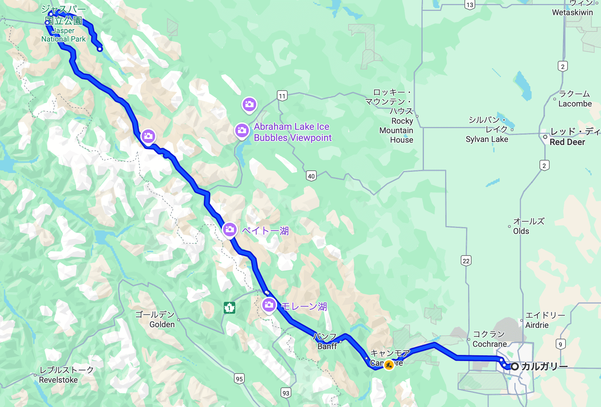
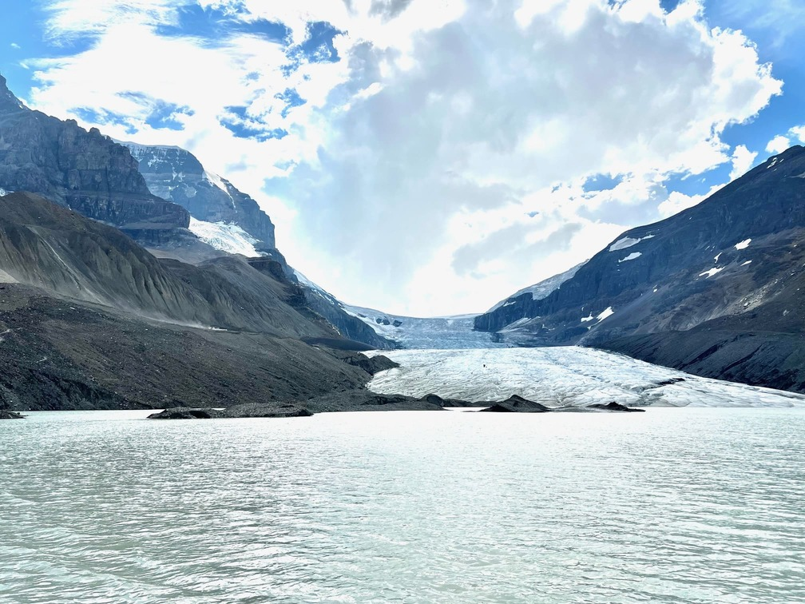
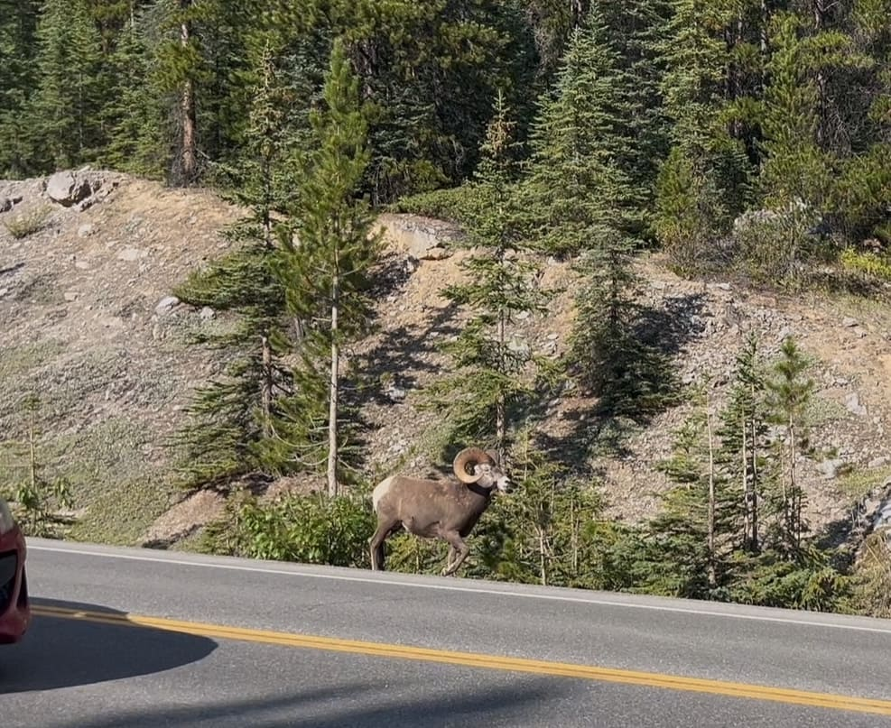
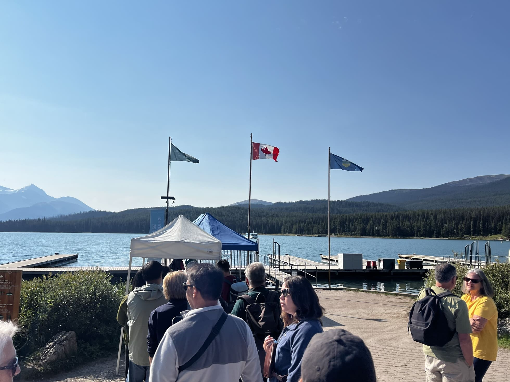
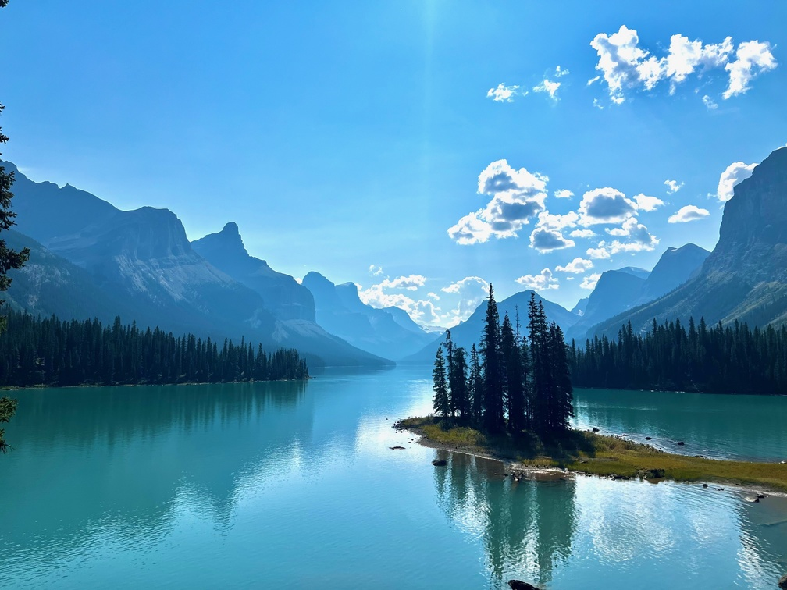
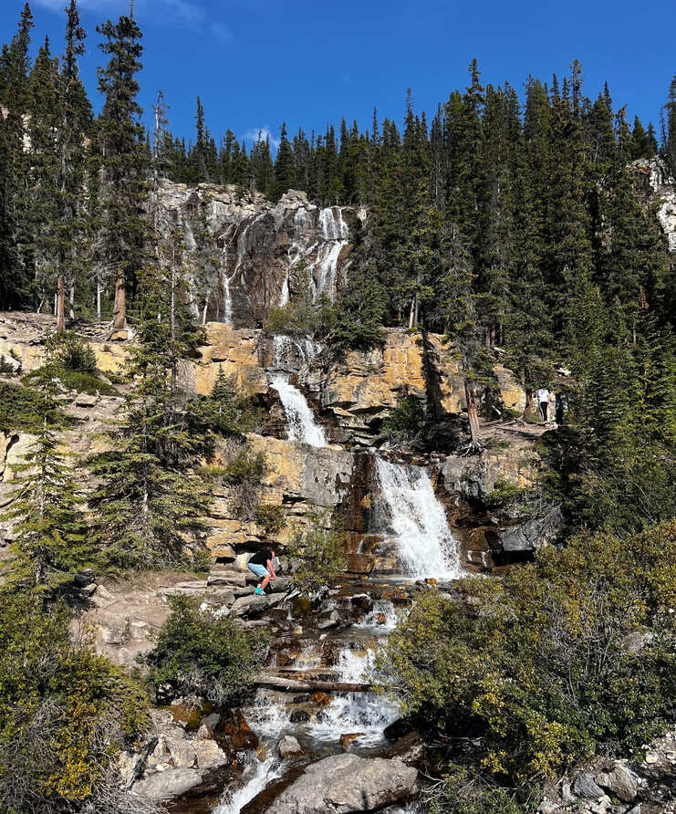
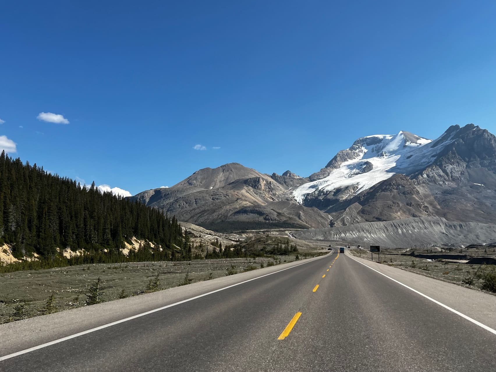
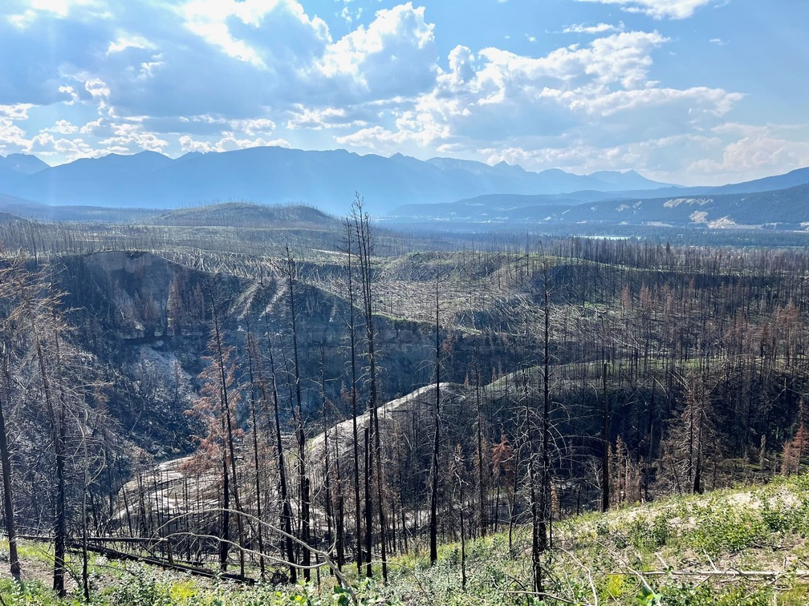
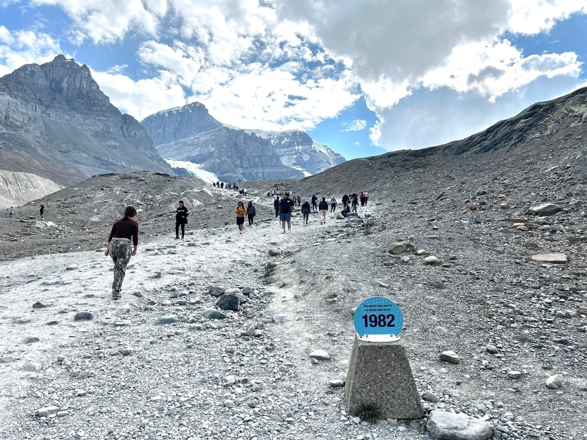

## カナダが誇る世界遺産「ジャスパー国立公園」

カナダ留学中の最高の思い出の一つ、それは**ジャスパー国立公園**への旅でした。

カナディアン・ロッキーの北部に位置するジャスパー国立公園は、1984年にユネスコ世界遺産に登録された、カナダで最も美しい国立公園の一つです。今回は、カルガリーから車で約4時間、往復約1000キロメートルの壮大なロードトリップの記録をお届けします。

## 🚗 カルガリーからジャスパーへの道のり

### ルート概要

カルガリーからジャスパーへの道のりは、まさに絶景の連続です。

**主要ルート：**
- カルガリー → トランスカナダハイウェイ（1号線）
- カナナスキス・カントリーを通過
- バンフ国立公園経由
- アイスフィールド・パークウェイ（93号線）
- ジャスパー到着

この道のりは「世界で最も美しいドライブルート」の一つとして知られており、道中の景色だけでも十分に価値があります。

### ドライブのハイライト

**見どころポイント：**

1. **キャッスルマウンテン**
   - 城のような形状の印象的な山
   - 標高2,766メートル
   - 写真撮影の人気スポット

2. **ボウ湖（Bow Lake）**
   - エメラルドグリーンの美しい湖
   - ボウ氷河からの雪解け水
   - 湖畔での休憩に最適

3. **ペイト湖（Peyto Lake）**
   - 狼の頭の形をした独特な湖
   - ターコイズブルーの水面
   - 展望台からの絶景

道中では、エルク、ビッグホーンシープ、時にはグリズリーベアなど、野生動物との遭遇も珍しくありません。運転中は常に注意が必要ですが、これもカナディアン・ロッキーの魅力の一つです。

## 🏔️ コロンビア大氷原とアサバスカ氷河

### 氷河の現実

ジャスパーへの道中で必ず立ち寄りたいのが、**コロンビア大氷原**です。

**アサバスカ氷河の現状：**
- 1982年から現在まで約1.5km後退
- 氷河の面積は約30%減少
- 年間約5メートルのペースで後退継続中

駐車場から氷河まで歩いていくと、過去の氷河の位置を示す年代標識が点在しています。1980年代、1990年代、2000年代と、氷河がどれだけ後退したかを実際に目で見ることができ、地球温暖化の影響を肌で感じることができます。

### 氷河観光の体験

**アイス・エクスプローラー（雪上車）ツアー：**
- 所要時間：約90分
- 料金：大人 $140〜160
- 氷河の上を実際に歩ける貴重な体験
- 氷河の水を飲むことも可能

**グレイシャー・スカイウォーク：**
- ガラス張りの展望通路
- 渓谷の280メートル上空
- 360度のパノラマビュー
- 料金：大人 $35〜45

氷河の青く透き通った氷、深いクレバス、そして氷河が作り出した独特の地形は、まさに自然の芸術作品です。

## 🦌 野生動物との出会い

### ビッグホーンシープ

ジャスパー国立公園では、様々な野生動物に出会うことができます。

特に印象的だったのは、道路沿いで出会った**ビッグホーンシープ**の群れです。彼らは人間を恐れることなく、悠々と道路を横断していきます。

**野生動物観察のポイント：**
- 早朝と夕方が最も活発な時間帯
- 車内から観察（安全のため）
- 最低30メートル以上の距離を保つ
- 餌付けは絶対禁止
- 写真撮影は望遠レンズ使用推奨

### その他の野生動物

**公園内で見られる主な動物：**

1. **エルク（ワピチ）**
   - 秋の繁殖期には雄の鳴き声が響く
   - ジャスパータウン周辺でも頻繁に目撃

2. **ブラックベア・グリズリーベア**
   - 春から秋にかけて活動的
   - ベリーの季節は特に注意が必要

3. **マウンテンゴート**
   - 険しい岩場に生息
   - 白い毛皮が特徴的

4. **カリブー（トナカイ）**
   - 絶滅危惧種
   - 目撃は非常にレア

## 💎 マリーン湖とスピリット島

### カナディアン・ロッキー最大の自然湖

**マリーン湖（Maligne Lake）**は、ジャスパー国立公園の宝石とも呼ばれる美しい湖です。

**マリーン湖の特徴：**
- 全長：22キロメートル
- 最大深度：97メートル
- カナディアン・ロッキー最大の自然湖
- 氷河の岩粉によるターコイズブルーの水

湖の水の色は、氷河が削った岩の微粒子（ロックフラワー）が水中に浮遊することで生まれます。太陽光がこれらの粒子に反射し、あの神秘的なターコイズブルーを作り出しているのです。

### スピリット島への船旅

マリーン湖で最も有名なのが**スピリット島（Spirit Island）**です。

**スピリット島クルーズ：**
- 所要時間：90分
- 料金：大人 $85〜95
- 出航時刻：夏季は1日5〜8便
- 島への上陸時間：約15分

スピリット島は「カナディアン・ロッキーで最も写真に撮られる場所」として知られています。小さな島に生える数本の針葉樹と、背景の雪を頂いた山々が作り出す景観は、まさにカナダの原風景です。

**先住民の聖地：**
スピリット島は、地元の先住民にとって神聖な場所でもあります。彼らの伝説では、この島は精神世界への入り口とされ、特別な儀式が行われていた場所だと言われています。

## 🏡 ジャスパータウンの魅力

### 山間の小さな町

ジャスパータウンは、人口約5,000人の小さな山間の町ですが、観光客向けの施設が充実しています。

**タウンの特徴：**
- 標高1,062メートル
- 年間観光客数：約230万人
- レストラン・カフェ：50軒以上
- 宿泊施設：ホテルからB&Bまで多様

### おすすめレストラン

**地元の人気店：**

1. **The Raven Bistro**
   - 地元食材を使った創作料理
   - アルバータ産ビーフが絶品
   - 予算：$40〜60/人

2. **Jasper Brewing Company**
   - 地ビール醸造所併設
   - カジュアルな雰囲気
   - 予算：$25〜40/人

3. **Patricia Street Deli**
   - サンドイッチとスープの専門店
   - ハイキングのランチに最適
   - 予算：$15〜20/人

### 宿泊施設

**宿泊オプション：**

- **フェアモント・ジャスパー・パーク・ロッジ**
  - 最高級リゾートホテル
  - 湖畔のキャビンスタイル
  - 料金：$500〜1,000/泊

- **中級ホテル**
  - Sawridge Inn、Chateau Jasperなど
  - 料金：$200〜400/泊

- **ホステル・B&B**
  - バックパッカー向け
  - 料金：$50〜150/泊

## 🥾 アクティビティとハイキング

### 初心者向けトレイル

ジャスパーには、レベルに応じた様々なハイキングコースがあります。

**おすすめ初心者コース：**

1. **Valley of the Five Lakes**
   - 距離：4.5km（往復）
   - 所要時間：2時間
   - 5つの異なる色の湖を巡る

2. **Maligne Canyon**
   - 距離：3.7km（往復）
   - 所要時間：1.5時間
   - 深い渓谷と滝の絶景

3. **Pyramid Lake Loop**
   - 距離：5km（周回）
   - 所要時間：2時間
   - 湖畔の平坦なトレイル

### アドベンチャー・アクティビティ

**夏のアクティビティ：**
- ラフティング（アサバスカ川）
- カヌー・カヤック
- 乗馬ツアー
- マウンテンバイク
- ロッククライミング

**冬のアクティビティ：**
- スキー・スノーボード（Marmot Basin）
- スノーシューイング
- アイスウォーク（凍った滝）
- 犬ぞり体験
- オーロラ観察

## 🔥 2024年の山火事とその影響

### 自然災害の現実

2024年7月、ジャスパー国立公園は大規模な山火事に見舞われました。

**被害状況：**
- 焼失面積：約327平方キロメートル
- ジャスパータウンの建物の約30%が被害
- 25,000人以上が避難
- 復旧には数年を要する見込み

この山火事は、気候変動による高温と乾燥、そして落雷が原因とされています。カナダの美しい自然も、地球温暖化の影響を強く受けているのです。

### 復興への取り組み

**現在の状況：**
- 主要観光施設は順次再開
- 宿泊施設の復旧進行中
- 新たな防火対策の導入
- エコツーリズムへの転換促進

訪問者として私たちにできることは、責任ある観光を心がけ、地域経済の回復を支援することです。

## 🌿 環境保護と持続可能な観光

### Leave No Traceの原則

ジャスパー国立公園を訪れる際は、環境保護の意識を持つことが大切です。

**7つの原則：**
1. 事前の計画と準備
2. 耐久性のある地表面での活動
3. ゴミの適切な処理
4. 見つけたものはそのままに
5. 焚き火の影響を最小限に
6. 野生動物の尊重
7. 他の訪問者への配慮

### カナダパークスの取り組み

**環境保護プログラム：**
- 野生動物の生息地保護
- 絶滅危惧種の保護活動
- 気候変動研究
- 環境教育プログラム
- 先住民との協力関係構築

## 📝 旅行計画のアドバイス

### ベストシーズン

**季節別の特徴：**

**夏（6月〜8月）：**
- 全てのアトラクションがオープン
- ハイキングに最適
- 混雑のピーク
- 宿泊料金が最も高い

**秋（9月〜10月）：**
- 黄葉が美しい
- エルクの繁殖期
- 観光客が減少
- 天候が不安定

**冬（11月〜3月）：**
- ウィンタースポーツ
- オーロラ観察のチャンス
- 多くの道路が閉鎖
- 防寒対策必須

**春（4月〜5月）：**
- 雪解けで滝が最も豪快
- 野生動物が活発
- 一部施設はまだクローズ
- 天候の変化が激しい

### 必要な準備

**持ち物リスト：**
- レイヤリングできる服装
- 防水ジャケット
- ハイキングシューズ
- 日焼け止め・サングラス
- 熊スプレー（現地購入可）
- 双眼鏡
- 充電器・予備バッテリー
- 現金（一部施設はカード不可）

### 予算の目安

**3泊4日の旅行予算（1人あたり）：**

| 項目 | 費用 |
|------|------|
| 交通費（ガソリン・レンタカー） | $300〜500 |
| 宿泊費（3泊） | $450〜1,500 |
| 食事 | $200〜400 |
| アクティビティ | $200〜500 |
| 国立公園入園料 | $10.50/日 |
| **合計** | **$1,200〜3,000** |

## 🎓 留学生へのメッセージ

### カナダの大自然を体験しよう

カナダ留学は、勉強だけでなく、この国の壮大な自然を体験する絶好の機会です。

ジャスパー国立公園は、カナダの自然の美しさと厳しさ、そして私たち人間との関係を考えさせてくれる特別な場所です。氷河の後退、山火事の跡、そして再生していく自然の姿は、地球環境について深く考えるきっかけを与えてくれます。

**留学中にぜひ体験してほしいこと：**
- ロッキー山脈でのキャンプ
- 満天の星空観察
- 野生動物との遭遇
- 先住民文化の学習
- カナダ人の自然への敬意を理解

### 思い出作りのコツ

**より深い体験のために：**

1. **現地の人と交流する**
   - パークレンジャーの話を聞く
   - 地元のガイドツアーに参加
   - ビジターセンターで学ぶ

2. **記録を残す**
   - 写真だけでなく日記も
   - 動画で音も記録
   - スケッチブックを持参

3. **挑戦する**
   - 普段しないアクティビティに挑戦
   - 早起きして朝日を見る
   - 星空撮影にトライ

## まとめ

ジャスパー国立公園への旅は、カナダの自然の素晴らしさと、それを守ることの大切さを教えてくれました。

氷河の後退、山火事の傷跡、そして力強く再生する自然。これらすべてが、私たちに環境保護の重要性を語りかけています。留学生として、学生として、そして地球市民として、この美しい自然を次世代に引き継ぐ責任があります。

カナダ留学中の皆さん、ぜひ一度はジャスパーを訪れてください。教科書では学べない、生きた地球の姿がそこにあります。そして、その体験は必ず、あなたの人生の大切な1ページになることでしょう。

大自然の中で、自分自身と向き合い、地球の未来について考える。それがジャスパー国立公園が私たちに与えてくれる、最高の贈り物なのかもしれません。

---

**Canada Study Plus**では、カナダ留学中の旅行アドバイスも提供しています。学習と観光を両立させた充実した留学生活をサポートします。ジャスパーへの旅行計画もお気軽にご相談ください！